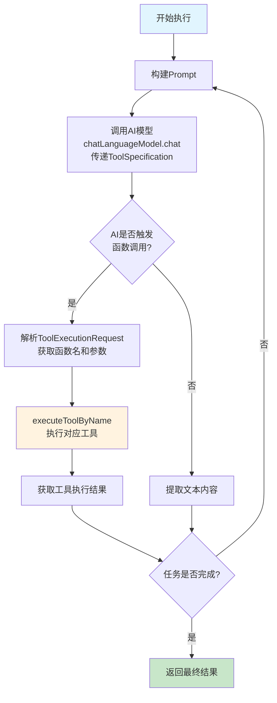

# AI Editor Agent 流程文档

## 一、业务流程

### 1.1 整体业务流程

```
┌─────────────────────────────────────────────────────────────────────────────────────────┐
│                                    用户请求流程                                          │
└─────────────────────────────────────────────────────────────────────────────────────────┘

    ┌──────────┐     ┌──────────────┐     ┌─────────────┐     ┌──────────────────┐
    │  用户    │────▶│  前端页面    │────▶│  REST API   │────▶│  Agent执行引擎   │
    └──────────┘     └──────────────┘     └─────────────┘     └──────────────────┘
                            │                    │                       │
                            │                    │                       │
                            ▼                    ▼                       ▼
                     ┌──────────────┐     ┌─────────────┐     ┌──────────────────┐
                     │  WebSocket   │◀────│  响应返回   │◀────│  文档编辑执行    │
                     │  实时更新    │     └─────────────┘     └──────────────────┘
                     └──────────────┘                                │
                            │                                         ▼
                            │                                 ┌──────────────────┐
                            └────────────────────────────────▶│  Diff生成器      │
                                                              └──────────────────┘
```

**流程说明：**

1. **用户输入**：用户在浏览器前端页面输入指令（如"用中文写一个故事"）
2. **前端发送请求**：前端通过 REST API 发送请求到后端
3. **Agent执行**：后端 Agent 引擎处理请求，调用 AI 模型进行文档编辑
4. **WebSocket推送**：Agent 执行过程中的每个步骤通过 WebSocket 实时推送到前端
5. **响应返回**：请求完成后返回任务状态和更新后的文档
6. **Diff对比**：系统生成修改前后的 Diff 对比结果，供前端展示

### 1.2 Agent执行流程（ReAct模式 + Function Calling）

```
┌─────────────────────────────────────────────────────────────────────────────────────────┐
│                                 ReAct Agent 执行流程                                      │
│                           (基于 LangChain4j Function Calling)                          │
└─────────────────────────────────────────────────────────────────────────────────────────┘

    ┌──────────────┐
    │   开始执行   │
    └──────┬───────┘
           │
           ▼
    ┌──────────────┐
    │ 1. 构建Prompt│ ◀── 组装系统提示 + 当前文档 + 用户指令
    │              │     (不再在Prompt中描述工具，通过ToolSpecification传递)
    └──────┬───────┘
           │
           ▼
    ┌──────────────────────────────────────────────────────────────┐
    │ 2. 调用AI模型 + 传递ToolSpecification                         │
    │    chatLanguageModel.chat(ChatRequest.builder()              │
    │        .messages(UserMessage.from(prompt))                  │
    │        .toolSpecifications(tools)                            │
    │        .build())                                            │
    └────────────────────────┬─────────────────────────────────────┘
                             │
                             ▼
    ┌──────────────────────────────────────────────────────────────┐
    │ 3. 检查AI响应                                                │
    │    aiMessage.hasToolExecutionRequests()                     │
    │                                                              │
    │    ┌─────────────────────┐    ┌─────────────────────────────┐│
    │    │ 是: 有函数调用请求   │    │ 否: 纯文本响应             ││
    │    │ 执行工具            │    │ 解析为思考/结果            ││
    │    └──────────┬──────────┘    └────────────┬──────────────┘│
    └───────────────┼─────────────────────────────┼───────────────┘
                    │                             │
                    ▼                             ▼
    ┌────────────────────────────┐    ┌────────────────────────────┐
    │ 4. 解析ToolExecutionRequest│    │ 4. 提取文本内容           │
    │    - toolRequest.name()   │    │    - aiMessage.singleText()│
    │    - toolRequest.arguments│    └────────────────────────────┘
    └──────────┬─────────────────┘
                │
                ▼
    ┌────────────────────────────┐
    │ 5. executeToolByName()    │ ◀── 根据函数名执行对应逻辑
    │    - readDocument         │     - editDocument: 真正更新文档
    │    - editDocument         │     - searchContent: 搜索内容
    │    - searchContent        │     - formatDocument: 格式化
    │    - formatDocument       │     - analyzeDocument: 分析统计
    │    - analyzeDocument      │     - 等...
    │    - 等...                │
    └──────────┬─────────────────┘
                │
                ▼
    ┌────────────────────────────┐
    │ 6. 获取工具执行结果        │
    │    返回字符串结果          │
    └──────────┬─────────────────┘
                │
                ▼
    ┌─────────────────────────────────────────────────────────────┐
    │                    判断是否完成                               │
    │  ┌─────────────────────────────────────────────────────┐   │
    │  │ 是: 完成任务，返回最终结果                          │   │
    │  │ 否: 返回第1步，传递上一步的工具调用信息继续循环     │   │
    │  └─────────────────────────────────────────────────────┘   │
    └─────────────────────────────────────────────────────────────┘
```

**流程说明：**

1. **构建Prompt**：组装系统提示、当前文档内容、用户指令。工具不再通过文本描述，而是通过 `ToolSpecification` 传递给 AI
2. **调用AI模型**：使用 `ChatLanguageModel.chat(ChatRequest)` 方法，同时传递 Prompt 和工具规范
3. **检查AI响应**：判断 AI 是否触发函数调用（`hasToolExecutionRequests()`）
4. **解析请求**：如果是函数调用，解析 `ToolExecutionRequest` 获取函数名和参数
5. **执行工具**：根据函数名执行对应的工具逻辑（如编辑文档、搜索内容等）
6. **获取结果**：获取工具执行结果，返回给 AI 供下一步使用
7. **判断完成**：如果任务完成则返回最终结果，否则继续循环

**Mermaid 流程图：**



### 1.3 前后端通信流程

```
┌─────────────────────────────────────────────────────────────────────────────────────────┐
│                              前后端通信流程                                               │
└─────────────────────────────────────────────────────────────────────────────────────────┘

    前端                                                           服务端
      │                                                               │
      │─────── 1. WebSocket 连接 ws://host/ws/agent ────────────────▶│
      │◀────── 2. CONNECTED 消息 (包含sessionId) ────────────────────│
      │                                                               │
      │─────── 3. POST /api/agent/execute ──────────────────────────▶│
      │         (body: {documentId, instruction, mode})               │
      │                                                               │
      │◀────── 4. HTTP 响应 {taskId, status: RUNNING} ───────────────│
      │                                                               │
      │◀────── 5. WebSocket: STEP 消息 (THINKING) ──────────────────│
      │         {type: "STEP", stepType: "THINKING", content: "..."} │
      │                                                               │
      │◀────── 6. WebSocket: STEP 消息 (ACTION/OBSERVATION) ─────────│
      │         {type: "STEP", stepType: "ACTION", toolName: "..."}   │
      │                                                               │
      │◀────── 7. WebSocket: STEP 消息 (结果) ──────────────────────│
      │         {type: "STEP", stepType: "OBSERVATION", content: ".."}│
      │                                                               │
      │                    ... 循环步骤5-7 ...                        │
      │                                                               │
      │◀────── N. WebSocket: COMPLETED 消息 ────────────────────────│
      │         {type: "STEP", stepType: "COMPLETED", content: "..."} │
      │                                                               │
      │─────── 8. GET /api/documents/{id} ─────────────────────────▶│
      │◀────── 9. 返回更新后的文档内容 ──────────────────────────────│
      │                                                               │
      │─────── 10. GET /api/diff/{documentId} ──────────────────────▶│
      │◀────── 11. 返回Diff对比结果 ─────────────────────────────────│
```

**流程说明：**

1. **WebSocket连接**：前端与后端建立 WebSocket 连接，服务端返回 CONNECTED 消息和 sessionId
2. **发送请求**：前端通过 REST API 发送 Agent 执行请求，包含文档ID、指令、模式
3. **HTTP响应**：后端立即返回任务ID和运行状态（不等待执行完成）
4. **步骤推送**：Agent 执行过程中，通过 WebSocket 实时推送每个步骤（THINKING/ACTION/OBSERVATION）
5. **完成推送**：任务完成后推送 COMPLETED 消息
6. **获取结果**：前端可通过 REST API 获取更新后的文档内容
7. **获取Diff**：前端可请求 Diff 对比结果，展示修改前后变化

### 1.4 Diff对比流程

```
┌─────────────────────────────────────────────────────────────────────────────────────────┐
│                                Diff 对比生成流程                                          │
└─────────────────────────────────────────────────────────────────────────────────────────┘

    ┌──────────────┐     ┌──────────────┐     ┌──────────────┐
    │  原始文档    │     │  编辑后文档  │     │  Diff生成器  │
    │  内容        │     │  内容        │     │              │
    └──────┬───────┘     └──────┬───────┘     └──────┬───────┘
           │                    │                    │
           │────────────────────┼────────────────────│
                                │                    ▼
                                ▼           ┌─────────────────┐
                       ┌─────────────────┐    │ 逐行对比分析    │
                       │ 逐行对比分析    │    │ (+绿色/-红色)  │
                       │ (行号、行内容)  │    └────────┬────────┘
                       └────────┬────────┘             │
                                │                     │
                                └──────────┬──────────┘
                                           │
                                           ▼
                                  ┌─────────────────┐
                                  │   DiffResult    │
                                  │   返回给前端    │
                                  └─────────────────┘
```

**流程说明：**

1. **原始文档**：获取 Agent 执行前的文档内容
2. **编辑后文档**：获取 Agent 执行后的文档内容
3. **逐行对比**：将两个文档内容逐行进行对比
4. **生成标记**：对每行标记颜色（绿色表示新增，红色表示删除）
5. **返回结果**：将 Diff 结果返回给前端展示

---

## 二、代码架构

### 2.1 项目包结构

```
com.agent.editor/
├── AiEditorApplication.java              # Spring Boot 启动类
│
├── config/                               # 配置类
│   ├── LangChainConfig.java              # LangChain4j配置 (ChatLanguageModel)
│   ├── WebSocketConfig.java              # WebSocket配置
│   └── OpenApiConfig.java                # Swagger配置
│
├── controller/                           # 控制器层
│   ├── DocumentController.java           # 文档管理接口
│   ├── AgentController.java              # Agent执行接口
│   ├── DiffController.java               # Diff对比接口
│   └── PageController.java               # 页面路由
│
├── service/                              # 服务层
│   └── DocumentService.java              # 文档和Agent任务服务
│
├── agent/                               # Agent核心模块
│   ├── BaseAgent.java                   # Agent基类 (抽象)
│   ├── ReActAgent.java                  # ReAct模式实现
│   ├── PlanningAgent.java               # Planning模式实现
│   └── tools/                           # 工具类 (保留,未使用)
│       └── DocumentTools.java           # 工具定义(备用)
│
├── model/                               # 数据模型
│   ├── Document.java                    # 文档模型
│   ├── AgentState.java                  # Agent状态
│   ├── AgentStep.java                   # Agent步骤
│   ├── AgentMode.java                   # Agent模式枚举
│   └── AgentStepType.java               # 步骤类型枚举
│
├── dto/                                 # 数据传输对象
│   ├── AgentTaskRequest.java            # Agent任务请求
│   ├── AgentTaskResponse.java           # Agent任务响应
│   ├── WebSocketMessage.java            # WebSocket消息
│   └── DiffResult.java                  # Diff结果
│
└── websocket/                           # WebSocket模块
    ├── WebSocketService.java            # WebSocket服务
    └── AgentWebSocketHandler.java       # WebSocket处理器
```

### 2.2 Agent核心类说明

#### BaseAgent (抽象基类)

```java
public abstract class BaseAgent implements AgentExecutor {
    
    // 核心方法
    public AgentState execute(...)         // 主执行方法
    protected void executeLoop(...)       // 执行循环
    protected abstract List<ToolSpecification> buildTools();  // 构建工具规范
    protected abstract String getInitialPrompt(AgentState state);  // 初始Prompt
    protected abstract String getNextPrompt(AgentState state, AgentStep previousStep, Map<String, Object> metadata);  // 后续Prompt
    
    // 工具执行
    protected String executeToolByName(ToolExecutionRequest request, Document doc);  // 执行工具
    private Map<String, Object> parseJsonArguments(String json);  // 解析JSON参数
}
```

**关键特性:**
- 使用 `ChatLanguageModel.chat(ChatRequest)` 传递 `ToolSpecification`
- AI响应通过 `aiMessage.hasToolExecutionRequests()` 判断是否有函数调用
- 通过 `toolRequests.get(0).name()` 和 `.arguments()` 获取函数名和参数
- 将工具调用信息（函数名、参数、结果）存入 `AgentStep.metadata` 供后续步骤使用

#### ReActAgent (实现类)

```java
@Component
public class ReActAgent extends BaseAgent {
    
    @Override
    protected List<ToolSpecification> buildTools() {
        // 使用 ToolSpecification.builder() 定义8个工具
        // - readDocument: 读取文档
        // - editDocument: 编辑文档 (content参数)
        // - searchContent: 搜索内容 (pattern参数)
        // - formatDocument: 格式化文档
        // - analyzeDocument: 分析文档
        // - undoChange: 撤销更改
        // - previewChanges: 预览更改
        // - compareVersions: 版本对比
    }
    
    @Override
    protected String buildSystemPrompt(AgentState state) {
        // 构建系统提示 (不含工具描述,工具通过ToolSpecification传递)
    }
    
    @Override
    protected String getNextPrompt(AgentState state, AgentStep previousStep, Map<String, Object> metadata) {
        // 如果上一步是函数调用，Prompt中包含:
        // - Function called: xxx
        // - Arguments: {...}
        // - Result: ...
    }
}
```

### 2.3 请求处理流程

```
┌─────────────────────────────────────────────────────────────────────────────────────────┐
│                               请求处理代码流程                                            │
└─────────────────────────────────────────────────────────────────────────────────────────┘

    HTTP POST /api/agent/execute
           │
           ▼
┌──────────────────────────┐
│  AgentController         │  ◀── @PostMapping("/execute")
│  execute()              │      接收 AgentTaskRequest
└────────────┬─────────────┘
             │
             ▼
┌──────────────────────────┐
│  DocumentService        │  ◀── executeAgentTask()
│                         │      获取 Document
└────────────┬─────────────┘
             │
             ▼
┌──────────────────────────┐
│  ReActAgent / Planning  │  ◀── execute()
└────────────┬─────────────┘
             │
             ▼
    ┌─────────────────────────────────────────┐
    │           executeLoop() 循环            │
    │                                         │
    │  1. 构建Prompt (getInitialPrompt)       │
    │  2. 构建ToolSpecification (buildTools) │
    │                                         │
    │  3. 调用AI模型                          │
    │     ChatRequest request =              │
    │       ChatRequest.builder()             │
    │         .messages(UserMessage.from(prompt))
    │         .toolSpecifications(tools)      │
    │         .build();                       │
    │     Response<AiMessage> response =      │
    │       chatLanguageModel.chat(request);  │
    │                                         │
    │  4. 检查函数调用                        │
    │     if (aiMessage.hasToolExecution... │
    │                                         │
    │  5. 执行工具或解析文本                  │
    │     executeToolByName() 或 singleText()│
    │                                         │
    │  6. 构建AgentStep + WebSocket推送        │
    │                                         │
    │  7. 判断是否完成                        │
    └────────────┬────────────────────────────┘
                 │
                 ▼
    ┌─────────────────────────────────────────┐
    │           更新文档 + 生成Diff            │
    │  document.setContent(finalContent)      │
    │  generateDiff(original, modified)        │
    └────────────┬────────────────────────────┘
                 │
                 ▼
          AgentTaskResponse
                 │
                 ▼
             HTTP 响应
```

### 2.4 WebSocket处理流程

```
┌─────────────────────────────────────────────────────────────────────────────────────────┐
│                             WebSocket 处理代码流程                                        │
└─────────────────────────────────────────────────────────────────────────────────────────┘

    WebSocket连接 ws://host/ws/agent
         │
         ▼
┌──────────────────────────┐
│ AgentWebSocketHandler    │
│ afterConnectionEstablished│
└────────────┬─────────────┘
             │
             ▼
┌──────────────────────────┐
│ WebSocketService         │
│ registerSession()        │  ◀── 存储 sessionId -> WebSocketSession
└────────────┬─────────────┘
             │
             ▼
    发送 CONNECTED 消息给前端
    {type: "CONNECTED", sessionId: "xxx"}

    ─────────────────────────────────────────

    Agent执行中推送消息
             │
             ▼
┌──────────────────────────┐
│ BaseAgent                │
│ sendStepUpdate()         │
└────────────┬─────────────┘
             │
             ▼
┌──────────────────────────┐
│ WebSocketService         │
│ sendToSession()          │  ◀── 根据sessionId查找WebSocketSession
└────────────┬─────────────┘
             │
             ▼
    session.sendMessage()
```

---

## 三、关键类说明

### 3.1 BaseAgent 核心方法

| 方法 | 描述 |
|------|------|
| `execute()` | 主执行方法，初始化AgentState并启动循环 |
| `executeLoop()` | 执行循环，处理每个推理步骤 |
| `buildTools()` | 构建ToolSpecification列表，定义可用工具 |
| `getInitialPrompt()` | 构建第一步发送给AI的Prompt |
| `getNextPrompt()` | 构建后续步骤的Prompt，包含上一步的函数调用信息 |
| `executeToolByName()` | 根据ToolExecutionRequest执行对应的工具逻辑 |
| `parseJsonArguments()` | 解析函数调用参数(JSON格式) |

### 3.2 ToolSpecification 使用

```java
// 定义工具示例
ToolSpecification.builder()
    .name("editDocument")
    .description("Edit the document content with specified changes")
    .parameters(JsonObjectSchema.builder()
        .addStringProperty("content", "The new content")
        .required("content")
        .build())
    .build()
```

**优势:**
- 工具定义结构化，参数类型清晰
- LLM能更准确地理解工具用途和参数
- 不需要在Prompt中额外描述工具

### 3.3 AgentStep 元数据

当AI触发函数调用时，AgentStep的metadata包含:

| Key | 描述 |
|-----|------|
| `toolName` | 调用的函数名 (如 editDocument) |
| `toolArguments` | 函数参数 (JSON字符串) |
| `toolResult` | 函数执行结果 |

这些信息会在下一步Prompt中传递给AI，帮助其理解上一步的执行情况。

### 3.4 WebSocketService 核心方法

| 方法 | 描述 |
|------|------|
| `registerSession()` | 注册新的WebSocket会话 |
| `unregisterSession()` | 注销WebSocket会话 |
| `bindTaskToSession()` | 将任务ID绑定到会话 |
| `sendToSession()` | 向指定会话发送消息 |
| `broadcast()` | 广播消息到所有会话 |

### 3.5 DocumentService 核心方法

| 方法 | 描述 |
|------|------|
| `createDocument()` | 创建新文档 |
| `getDocument()` | 获取文档 |
| `updateDocument()` | 更新文档内容 |
| `executeAgentTask()` | 执行Agent任务 |
| `generateDiff()` | 生成Diff对比 |

---

## 四、序列图

### 4.1 Agent任务执行序列图（Function Calling）

```
┌────────┐     ┌────────┐     ┌────────┐     ┌────────┐     ┌────────┐     ┌────────┐
│  前端  │     │Controller│    │Service │     │ReAct   │     │LangChain│    │ 工具   │
│        │     │        │     │        │     │Agent   │     │   4j   │     │执行   │
└───┬────┘     └───┬────┘     └───┬────┘     └───┬────┘     └───┬────┘     └───┬────┘
    │             │             │             │             │             │
    │ POST /execute             │             │             │             │
    │──────────▶│─────────────▶│─────────────▶│─────────────▶│             │
    │             │             │             │             │             │
    │             │             │  execute() │             │             │
    │             │             │◀────────────│────────────▶│             │
    │             │             │             │             │             │
    │             │             │  Prompt + ToolSpecification             │
    │             │             │◀────────────│────────────▶│             │
    │             │             │             │             │             │
    │             │             │             │  返回AiMessage             │
    │             │             │◀────────────│◀────────────│             │
    │             │             │             │             │             │
    │             │             │ hasToolExecutionRequests() = true       │
    │             │             │◀────────────│             │             │
    │             │             │             │             │             │
    │             │             │  executeToolByName()                   │
    │             │             │◀────────────│────────────▶│             │
    │             │             │             │  返回执行结果             │
    │             │             │◀────────────│◀────────────│             │
    │             │             │             │             │             │
    │             │             │  WebSocket推送 STEP                  │
    │◀────────────│◀────────────│◀────────────│             │             │
    │             │             │             │             │             │
    │             │             │  循环步骤3-8 (继续或完成)             │
    │             │             │             │             │             │
    │             │             │             │             │             │
    │◀────────────│◀────────────│◀────────────│             │             │
    │  COMPLETED  │             │             │             │             │
    │             │             │             │             │             │
```

### 4.2 WebSocket连接序列图

```
┌────────┐                     ┌────────┐
│  前端  │                     │ 服务端 │
└───┬────┘                     └───┬────┘
    │                                 │
    │──── WebSocket Connect ─────────▶│
    │    ws://host/ws/agent          │
    │                                 │
    │◀── CONNECTED {sessionId} ──────│
    │                                 │
    │                                 │
    │──── SUBSCRIBE {taskId} ────────▶│
    │                                 │
    │                                 │
    │◀── STEP {type: THINKING} ──────│
    │◀── STEP {type: ACTION} ─────────│
    │◀── STEP {type: OBSERVATION} ────│
    │          ...                     │
    │◀── STEP {type: COMPLETED} ──────│
    │                                 │
    │──── Connection Close ──────────▶│
```
